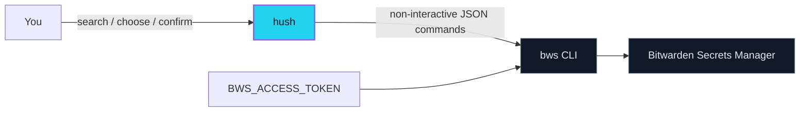

<p align="center">
  
</p>

<p align="center">
  <strong>Your secrets should not need a five-step web ceremony.</strong>
</p>

<p align="center">
  <a href="https://crates.io/crates/bws-tui"></a>
  <a href="https://crates.io/crates/bws-tui"></a>
  <a href="./LICENSE"></a>
  <a href="https://github.com/AojdevStudio/agentic-utilities/actions/workflows/ci.yml"></a>
</p>

<p align="center">
  <code>cargo install --locked bws-tui</code> &nbsp;→&nbsp; <code>hush</code>
</p>

<p align="center">
  
</p>

> **Package:** `bws-tui` on crates.io · **Command:** `hush`

## The five-step problem

Adding one secret should take seconds. Instead, the Bitwarden web path means opening a browser, signing in, finding Secrets Manager, finding the right project, and finally creating the secret.

The official `bws` CLI already has the authentication and API access. What it does not have is a fast human interface for the two things you do constantly:

1. put a secret somewhere;
2. find it again without exposing it everywhere.

## The insight

**Do not replace `bws`. Make it pleasant.**

`hush` owns no authentication flow, cloud client, or private secret format. It shells out to the official CLI with JSON I/O, then gives you a focused TUI and predictable commands. Bitwarden remains the source of truth; `hush` removes the ceremony.

## What changes

| Before | With `hush` |
| --- | --- |
| Navigate the web vault to add one value | `hush` → Add → project → key → masked value |
| Remember which project contains a key | Search every accessible project as you type |
| Print values into terminal scrollback | Copy through an explicit action menu |
| Repeat browser steps for edits | Edit key, value, or note in place |
| Write one-off shell wrappers for CI | Use the same CRUD operations non-interactively |

## Why it feels quiet

- **Type to find.** Fuzzy filtering is always live; arrows always move.
- **Enter means actions, never exit.** Copy, Reveal, Edit, Delete, or Cancel appear as plain English.
- **Values stay out of lists and logs.** Reveal is deliberate; copy is explicit.
- **Clipboard copies expire.** The value clears after 30 seconds if it is still unchanged and `hush` remains open.
- **Projects never drift.** The menu comes from `bws project list` every time.
- **No config file.** `bws` keeps its token/profile configuration; `hush` adds none.

## Quick start

### 1. Install Bitwarden's CLI

Install the official [`bws` binary](https://github.com/bitwarden/sdk-sm/releases) and make sure it is on `PATH`. `hush` is developed against `bws` 2.1.0.

### 2. Load a machine-account token automatically

Create a token under **Secrets Manager → Machine accounts** in Bitwarden. Put it in your global `~/.env` so every terminal can use it without another setup step:

```bash
# ~/.env
export BWS_ACCESS_TOKEN="..."
```

Protect the file after saving it:

```bash
chmod 600 ~/.env
```

Shells do not load `~/.env` automatically. Source it from your shell startup file:

```bash
# ~/.zshrc on macOS, or ~/.bashrc when using Bash
[ -f "$HOME/.env" ] && source "$HOME/.env"
```

Load it now, then verify the official CLI before starting `hush`:

```bash
source ~/.zshrc # use ~/.bashrc for Bash
bws project list
```

New terminals will load the token automatically. No login flow exists in `hush`; the token is consumed by `bws` itself.

### 3. Install the crate, run the good command

```bash
cargo install --locked bws-tui
hush
```

Tested on macOS. The crate uses `arboard` for cross-platform clipboard access, but other platforms are not yet part of the release verification matrix.

## The interface

### Search and manage

```text
Type                Filter across every accessible project
↑ / ↓               Move through matches
Enter               Open Copy / Reveal / Edit / Delete / Cancel
Esc                 Back out one level
```

Inside the action menu, arrows + Enter are enough. Optional shortcuts are `c` (copy), `r` (reveal), `e` (edit), and `d` (delete). Delete always requires confirmation.

### Add a secret

```text
hush
  → Add a secret
  → choose a live-fetched project
  → enter the key
  → enter the masked value
```

## Scripts and CI

Every operation also works without the TUI:

```bash
hush list
hush get --key DB_PASSWORD
hush add --project "API Keys" --key NEW_SECRET --value 'not-a-real-secret'
hush edit --key DB_PASSWORD --value 'new-value' --note "rotated"
hush delete --key OLD_SECRET --yes
```

Project names and UUIDs both work. Without `--project`, get/edit/delete search all accessible projects and require an unambiguous key.

### Multiline values

`add` reads stdin when `--value` is absent and preserves the bytes exactly—including a trailing newline:

```bash
hush add --project "API Keys" --key TLS_PRIVATE_KEY < key.pem
```

For edits, stdin is deliberately explicit so a note-only edit can never block or erase the value:

```bash
hush edit --key TLS_PRIVATE_KEY --stdin < replacement-key.pem
```

## How it works



That narrow boundary is the point. `hush` is an interface, not another secrets platform.

## Security model

- **Masked entry:** TUI value input is never rendered as plaintext while typing.
- **No values in lists:** search rows contain only key and project name.
- **Sanitized failures:** failed `bws` operations report the operation and exit status, never the secret-bearing argv.
- **Conditional clipboard clear:** after 30 seconds, `hush` clears the clipboard only if it still contains the value it copied. Your newer clipboard content is left alone.
- **Delete guard:** the TUI confirms deletion; scripts require `--yes`.

### Known upstream limit: argv exposure

`bws` 2.1.0 accepts create/edit values only as positional argv. That makes a value briefly visible to local process inspection (`ps`) while the subprocess runs. `hush` cannot remove that exposure until upstream supports stdin or file descriptors.

This tool is designed first for a trusted, single-user Mac—not a shared shell host.

## The story

`hush` started because adding a secret through bitwarden.com was just annoying enough to avoid: a five-step interruption for a five-second task.

The first implementation copied the obvious CLI behavior and printed selected values to terminal scrollback. One real-world test immediately proved why that was wrong. The UX changed: Enter now opens a plain-English action menu, copy is the safe default, reveal is explicit, and the app never exits just because you selected something.

That is the whole design philosophy: **the secure path should also be the path of least resistance.**

## Development

```bash
cargo fmt --check
cargo test
cargo clippy -- -D warnings
cargo publish --dry-run
```

The demo uses [VHS](https://github.com/charmbracelet/vhs) with safe fake data. Re-record it from the crate directory after building `hush`:

```bash
cargo build --release
PATH="$PWD/docs/demo:$PWD/target/release:$PATH" vhs docs/assets/hush-demo.tape
```

## Contributing

`hush` lives inside [AojdevStudio/agentic-utilities](https://github.com/AojdevStudio/agentic-utilities/tree/main/bws-tui). Bugs and focused improvements belong in that repository's issue tracker.

If the idea saves you a browser trip, star the repo. If the interface makes you think, “this should be one keystroke simpler,” open an issue—that is exactly how `hush` got good.

## License

MIT © Ossie Irondi
