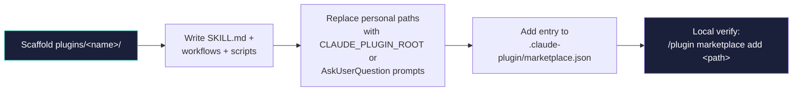

# Claude Code lane


**Curated Claude Code plugins from the [agentic-utilities](../README.md) marketplace.**

[](https://opensource.org/licenses/MIT)
[](https://docs.claude.com/en/docs/claude-code)

This is the Claude Code lane of `agentic-utilities` — a multi-harness curated tooling repo with parallel lanes for [Claude Code](https://docs.claude.com/en/docs/claude-code), the [pi coding agent](https://github.com/mariozechner/pi-coding-agent), and OpenAI Codex Agent Skills. Plugins land here when they shine best inside Claude Code; lighter pi extensions live in [`../extensions/`](../extensions/) and harness-agnostic Agent Skills live in [`../skills/`](../skills/).

---

## Plugins

| Plugin | Description | Install |
|---|---|---|
| **[youtube-analyzer](./plugins/youtube-analyzer/)** | Format-aware YouTube video analysis with multi-agent transcript chunking, GitHub repo cross-referencing for tutorials, and package version-drift tracking. | `/plugin install youtube-analyzer@agentic-utilities` |

More plugins land here as they're ported. The [issues tab](https://github.com/AojdevStudio/agentic-utilities/issues) tracks what's queued.

---

## Quick start

Inside any Claude Code session:

```text
/plugin marketplace add AojdevStudio/agentic-utilities
/plugin install <plugin-name>@agentic-utilities
```

This works because the marketplace manifest lives at the **repo root** (`.claude-plugin/marketplace.json`), so GitHub-based discovery picks it up without subpath configuration. Plugin source paths in that manifest point into this directory.

---

## Layout

```text
claude-code/
├── plugins/
│   └── <plugin-name>/
│       ├── .claude-plugin/
│       │   └── plugin.json
│       ├── commands/                Slash commands (.md)
│       ├── agents/                  Subagents (.md)
│       ├── skills/                  SKILL.md per skill
│       │   └── <skill-name>/SKILL.md
│       ├── hooks/
│       │   └── hooks.json           Event handlers
│       ├── .mcp.json                Optional MCP servers
│       ├── scripts/                 Helper scripts (TS / Python / shell)
│       └── README.md
├── assets/
│   └── banner.png
└── README.md                        This file
```

---

## Add a new plugin



1. Scaffold the plugin under `plugins/<plugin-name>/` — `/plugin-dev:create-plugin` works, or copy the layout from an existing plugin.
2. Write the SKILL.md, workflows, and scripts. **Audit for personal paths** — replace `${PAI_DIR}` and `/Users/...` references with `${CLAUDE_PLUGIN_ROOT}` (for plugin-internal paths) or `AskUserQuestion` prompts (for user-specific data like vault locations).
3. Add a marketplace entry to `../.claude-plugin/marketplace.json#/plugins[]`:

   ```json
   {
     "name": "<plugin-name>",
     "description": "...",
     "version": "0.1.0",
     "author": { "name": "..." },
     "source": "./claude-code/plugins/<plugin-name>",
     "category": "...",
     "license": "MIT"
   }
   ```

4. Verify locally: `/plugin marketplace add /Users/you/Projects/agentic-utilities` then `/plugin install <plugin-name>@agentic-utilities`.

---

## Conventions

- **Plugin names**: kebab-case, globally unique enough to avoid conflicts in users' installs (e.g., `youtube-analyzer`, not `analyzer`).
- **Internal paths**: every reference to a plugin-bundled file (hooks, MCP servers, helper scripts) uses `${CLAUDE_PLUGIN_ROOT}/...`.
- **Curation rule**: a plugin lives here only if it shines best in Claude Code. The same logical idea may exist as a pi extension in [`../extensions/`](../extensions/) or a generic Agent Skill in [`../skills/`](../skills/) — they're maintained independently.
- **Settings file pattern**: user-configurable plugin state goes in `.claude/<plugin-name>.local.md` (YAML frontmatter + markdown body), not hard-coded paths in code.

---

## License

MIT.

---

<sub>Part of [agentic-utilities](../README.md). The other lanes — `extensions/` (pi), `skills/` (Codex Agent Skills) — sit alongside this directory at the repo root.</sub>
