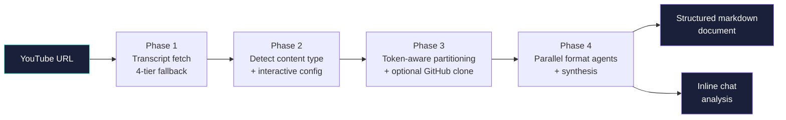

# youtube-analyzer


**Stop summarizing videos into a wall of bullet points. Start producing structured knowledge.**

[](https://opensource.org/licenses/MIT)
[](https://docs.claude.com/en/docs/claude-code)
[](../../README.md)

> **Why this exists.** Generic AI summarizers flatten every video into the same shape: a paragraph and some bullets. That's fine for a single watch — but it loses the structure of a tutorial, can't cross-reference the GitHub repo a tutorial points to, and forgets what packages were mentioned the moment the conversation ends. `youtube-analyzer` produces format-aware, structured markdown you can re-read, search, and feed into other tools.

---

## What it does



| | |
|---|---|
| **Format-aware** | Detects whether the video is a tutorial, course, finance video, interview, lecture, or general — and dispatches the matching analysis workflow. |
| **Multi-agent on long videos** | Token-aware partitioning splits 100K-token videos across parallel agents, then synthesizes the chunks into one document. |
| **GitHub repo cross-reference** | For tutorials, optionally clones the linked repo and produces Mermaid diagrams of structure, dependencies, and patterns — so you can see what the video taught vs. what the actual code does. |
| **Package version drift** | Tracks every package mentioned in tutorial videos in a local database, then queries npm / PyPI to flag versions that have moved on since the video shipped. |
| **Two delivery modes** | `--document` writes a permanent markdown file to your configured output dir; `--chat` returns the analysis inline so you can talk through it without saving. |

---

## Quick start

Inside Claude Code:

```text
/plugin marketplace add AojdevStudio/agentic-utilities
/plugin install youtube-analyzer@agentic-utilities
```

Then ask Claude:

```text
Analyze this video: https://youtube.com/watch?v=...
```

Or invoke explicitly with a flag:

```text
--chat https://youtube.com/watch?v=...      # inline, no file written
--document https://youtube.com/watch?v=...  # save to configured output dir (default)
```

---

## Required external tools

The skill verifies these on first run and exits cleanly if any are missing:

| Tool | Install |
|------|---------|
| `yt-dlp` | `pip install yt-dlp` or `brew install yt-dlp` |
| `youtube_transcript_api` | `pip install youtube-transcript-api` |
| `bun` | `curl -fsSL https://bun.sh/install \| bash` |

`bun` runs the four TypeScript helpers in `scripts/` (transcript cleanup, content-type detection, token partitioning, package database).

---

## How it works

Four phases, each with a blocking gate. The orchestrator never analyzes content directly — it routes work to specialized sub-agents.

### Phase 1 — Source

Pulls the transcript with a 4-tier fallback: `youtube_transcript_api` (high quality) → `yt-dlp` auto-subs (medium) → metadata-only (low) → graceful exit. Cleans VTT artifacts, counts words, captures video metadata.

### Phase 2 — Configure

Auto-detects category (technology / finance / business / etc.) and format (tutorial / course / finance / interview / lecture / general) using keyword scoring on the title, description, tags, and channel. Anything below 60% confidence triggers a confirmation prompt. Then asks you what outputs you want, what depth, and any format-specific focus.

### Phase 3 — Scale

Estimates token count and decides single-agent (≤30K) vs. multi-agent partitioning (30K–100K → 2-3 agents, >100K → 4+ agents at ~25K tokens each). For tutorials with a GitHub repo URL, three `Explore` sub-agents (StructureExplorer, DependencyExplorer, PatternExplorer) run in parallel against the cloned repo and produce Mermaid diagrams.

### Phase 4 — Synthesize

Each chunk runs through the format's workflow (`tutorial-workflow.md`, `finance-workflow.md`, or `general-workflow.md`). One synthesis agent merges chunk outputs, applies the YAML frontmatter and section templates, and either writes a markdown file or returns the rendered output inline. For tutorials, every package mentioned lands in the package database with version-drift tracking.

---

## Configuration

On first document-mode run, the skill asks where to save analyses and persists your answer to `.claude/youtube-analyzer.local.md` in the current project. You can edit that file anytime:

```markdown
---
output_directory: /absolute/path/to/your/notes
---
```

The package database is at `~/.config/youtube-analyzer/package-db.json` (auto-created).

---

## File layout

```text
youtube-analyzer/
├── .claude-plugin/
│   └── plugin.json
├── skills/
│   └── youtube-analyzer/
│       ├── SKILL.md                    Orchestration spine — 4 phases, blocking gates
│       ├── content-types.md            Category/format keyword scoring
│       ├── package-database-schema.md
│       ├── references/
│       │   ├── source-selection.md     Phase 1 mechanics (transcript fetch chain)
│       │   ├── scaling-and-repo-explore.md
│       │   ├── output-paths.md
│       │   └── output-templates.md
│       └── workflows/
│           ├── tutorial-workflow.md
│           ├── finance-workflow.md
│           ├── general-workflow.md
│           └── repo-exploration.md
├── scripts/
│   ├── clean-transcript.ts             Strip VTT artifacts
│   ├── detect-content-type.ts          Keyword-scored content-type detection
│   ├── partition-transcript.ts         Token-aware partitioning for parallel agents
│   └── package-db.ts                   Track tutorial packages with version drift
├── assets/
│   └── hero.png
├── README.md                           This file
└── CHANGES.md                          Differences from the personal (PAI) version
```

---

## Roadmap

- [ ] Local transcript-library browse mode (was in the personal version, dropped for portability)
- [ ] Sermon workflow as an optional companion plugin
- [ ] Channel-aware content-type tuning (auto-classify by channel signature)

## License

MIT.

---

<sub>Part of the [agentic-utilities](https://github.com/AojdevStudio/agentic-utilities) marketplace. See [CHANGES.md](./CHANGES.md) for differences from the original personal (PAI) version of this skill.</sub>
