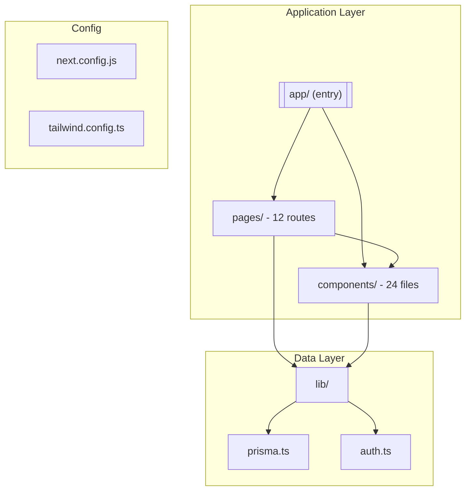
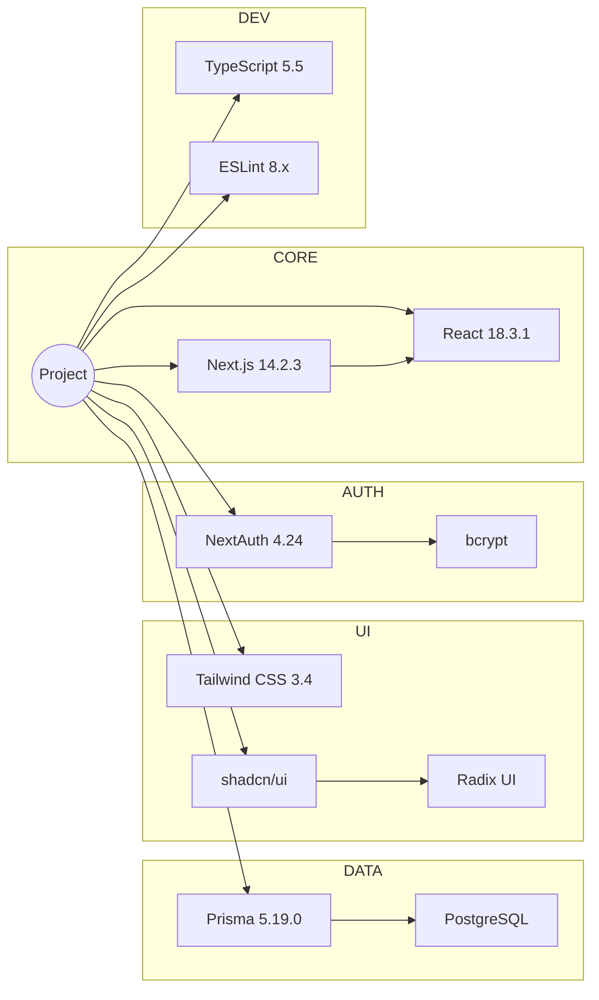
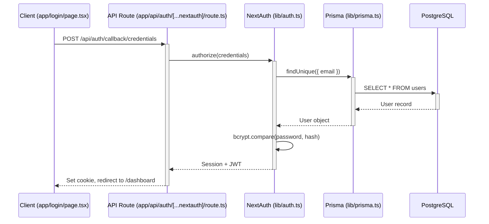
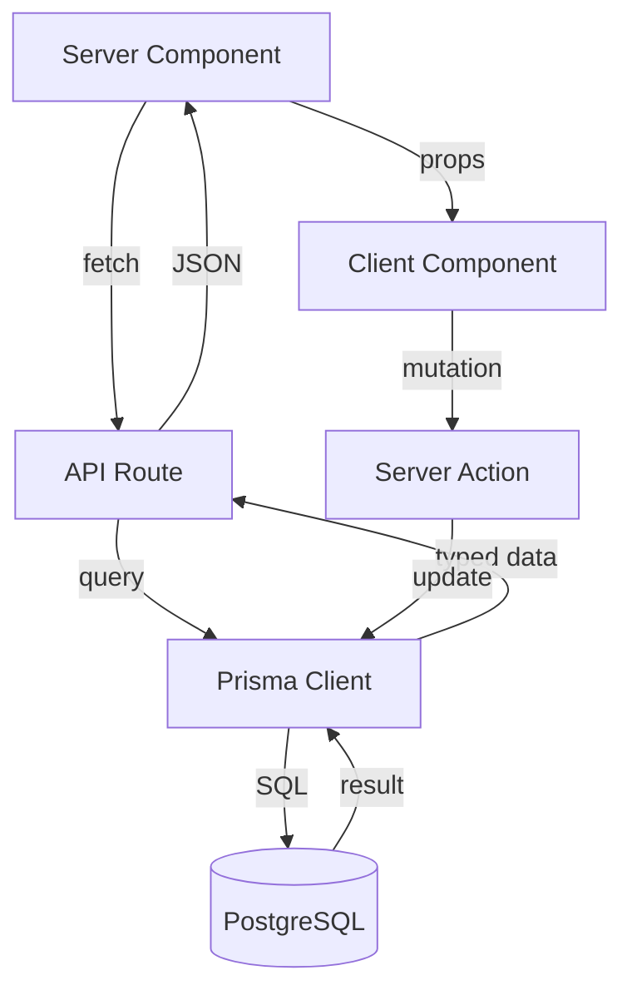

# Repo Exploration Workflow

Agent prompts for GitHub repository exploration during tutorial analysis. Produces Mermaid diagrams that represent the actual codebase (ground truth) for comparison against tutorial content.

## When This Runs

- Phase 3 of YouTubeAnalyzer, PARALLEL with transcript partitioning
- Only for tutorial/course format when user provides a GitHub repo URL
- Repo is cloned to `{scratchpad}/repo-explore/` with `--depth 1`

## Edge Case Handling

### Before Cloning

| Scenario | Detection | Action |
|----------|-----------|--------|
| **Private repo** | Clone fails with 403/404 | Ask user for token via AskUserQuestion, or skip |
| **Large repo (>10K files)** | After clone: `find . -type f \| wc -l` | Warn user, offer quick scan (top-level only) or skip |
| **Monorepo** | Multiple `package.json` at depth 1-2 | Ask user which workspace via AskUserQuestion |
| **Clone failure** | Any git clone error | Set `repoExploreResults = null`, note in output, continue with transcript-only analysis |
| **No package.json** | File not found | DependencyExplorer adapts: check for requirements.txt, go.mod, Cargo.toml, etc. |

### After Cloning

```bash
# Quick size check
find "{scratchpad}/repo-explore/" -type f | wc -l
```

If > 10,000 files, warn user before proceeding.

---

## Agent 1: StructureExplorer

**Agent type:** `Explore`
**Focus:** File organization, architecture, entry points

### Prompt

```
Explore the repository at {scratchpad}/repo-explore/ and produce a Mermaid graph TD diagram showing:

1. Top-level directory structure (max 3 levels deep)
2. Key entry points (index files, main files, app entry)
3. Component relationships (which directories import from which)
4. Configuration files location

Rules:
- Output ONLY a Mermaid graph TD diagram in a code fence
- Max 30 nodes (collapse subdirectories if needed)
- Use descriptive labels: "pages/ (12 routes)" not just "pages/"
- Highlight entry points with a different shape (e.g., [[ ]] for stadium shape)
- Group related directories with subgraph blocks
- Add a brief 2-3 sentence summary AFTER the diagram

Example output format:



Summary: Next.js app with 12 routes, 24 components, Prisma ORM for data access. Entry point is app/ directory using App Router.
```

---

## Agent 2: DependencyExplorer

**Agent type:** `Explore`
**Focus:** Dependencies with exact versions, configs

### Prompt

```
Explore the repository at {scratchpad}/repo-explore/ and produce a Mermaid graph LR diagram showing the dependency tree.

Steps:
1. Read package.json (or requirements.txt, go.mod, Cargo.toml if not Node)
2. Categorize each dependency:
   - CORE: Framework and essential runtime dependencies
   - DATA: Database, ORM, state management
   - UI: Styling, component libraries, icons
   - AUTH: Authentication and authorization
   - DEV: Testing, linting, build tools
   - OPTIONAL: Nice-to-have, plugins, extras
3. Record EXACT version from lock file if available

Rules:
- Output ONLY a Mermaid graph LR diagram in a code fence
- Include version numbers in labels: "Next.js 14.2.3"
- Group by category using subgraph blocks
- Max 40 nodes (collapse minor deps if needed)
- After the diagram, list ALL dependencies as a simple table:
  | Package | Version | Category | Purpose |

Example output format:



| Package | Version | Category | Purpose |
|---------|---------|----------|---------|
| next | 14.2.3 | CORE | React framework |
...
```

---

## Agent 3: PatternExplorer

**Agent type:** `Explore`
**Focus:** Data flow, state management, auth flow, API patterns

### Prompt

```
Explore the repository at {scratchpad}/repo-explore/ and produce Mermaid diagrams showing key implementation patterns.

Investigate:
1. **Authentication flow** - How users log in, session management, token handling
2. **Data flow** - How data moves from database to UI (API routes, server components, client fetching)
3. **State management** - Client-side state approach (React context, zustand, redux, etc.)
4. **API patterns** - Route structure, middleware, error handling

Rules:
- Output 2-3 Mermaid diagrams (sequence diagrams and/or flowcharts)
- Label each diagram with what pattern it shows
- Include actual file paths in participant names where relevant
- Max 15 steps per sequence diagram
- After diagrams, list key patterns as bullet points with file references

Example output format:

### Authentication Flow


### Data Flow


Key patterns:
- **Server Components for data fetching**: pages use RSC to fetch data without client-side loading states (app/dashboard/page.tsx)
- **Server Actions for mutations**: form submissions use server actions instead of API routes (app/actions/)
- **Prisma singleton**: Single Prisma client instance via lib/prisma.ts to prevent connection exhaustion
```

---

## Output Assembly

The orchestrator collects outputs from all 3 agents and assembles `repoExploreResults`:

```json
{
  "structure": "<full mermaid diagram + summary from StructureExplorer>",
  "dependencies": "<full mermaid diagram + table from DependencyExplorer>",
  "patterns": "<full mermaid diagrams + bullet points from PatternExplorer>",
  "summary": "Brief 2-3 sentence overview combining all findings"
}
```

This object is passed to the Phase 4 synthesis agent, which embeds the diagrams in the "Ground Truth Architecture" section of the final output.

---

## Cleanup

After Phase 4 synthesis is complete:

```bash
rm -rf "{scratchpad}/repo-explore/"
```

Do NOT clean up before synthesis -- agents may need to re-reference files during the merge.
